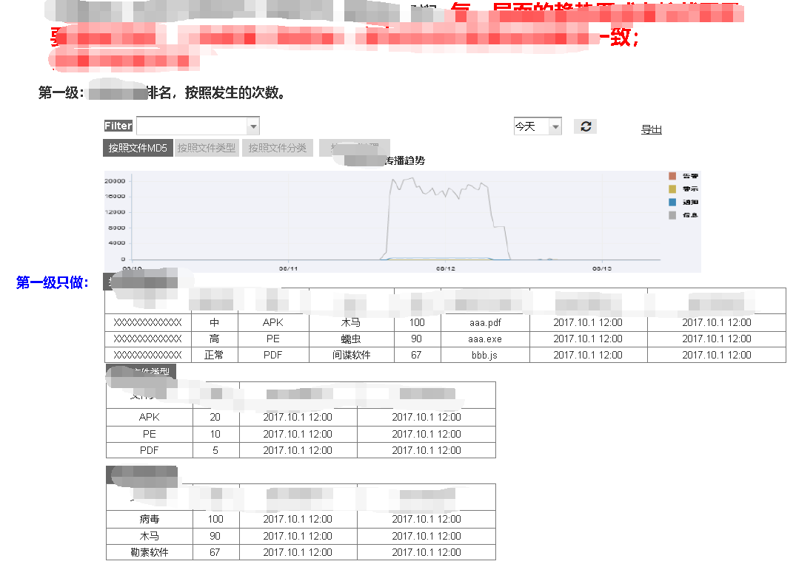
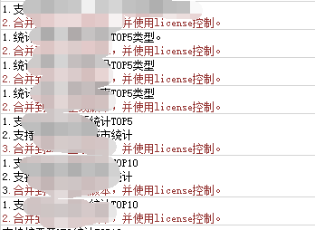
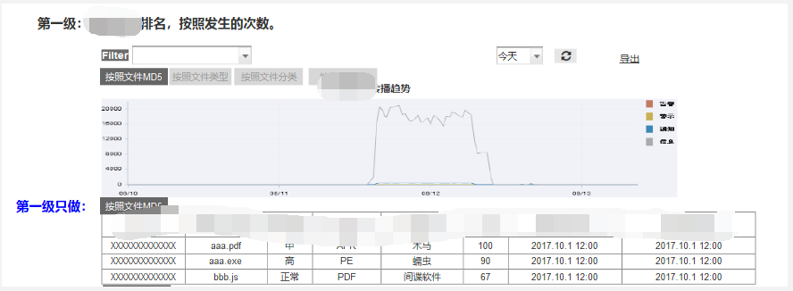

+++
title = 'IPS产品经理'
date = 2018-11-25T19:11:46+08:00
draft = true
+++

## 产品经理

2017 年 8 月, 我被转岗了. 转岗后, 我遇见了很多不曾想过的奇葩人 奇葩事.

本文仅从我个人角度, 描述我看到的, 一位新人产品经理, 如何从相识, 到相知, 然后走到了开发的对立面.

本文充满了个人情感, 完全作为吐槽用, 或许并不客观, 但保证所述为真材实料.

批评不自由, 则赞美无意义.

### 初来

大概是 8 9 月份某天吧, 这位并不萌的新产品经理来了, 被另一位产品经理带着, 和组里所有的开发&测试同学, 挨个碰了个面, 混了个脸熟.

> 由于我在新组里, 一直处于游离态, 只加了一个群, 实在看不到这位产品经理来的时间, 只能凭印象了.

说实话, 第一感觉不是很好, 换句话说, 毫无理由, 我并不喜欢这位产品经理. 不过虽然不怎么待见人家, 我还是希望她段位高一些的, 起码让我这种想躺赢的, 能躺的舒服些 😜

> 我这个人可能比较二, 或者是迷? 我很看重和陌生人第一次见面的感觉. 这个感觉, 从学生时代到现在, 整体偏准, 起码比我王者荣耀的胜率高多了. 那个, 戴口罩, 以及生病的不算.

### 平静

10 月份前后, 由于正在进行的项目需求已定, 也有可能是我没有进入到敌军核心, 了解不到高层信息, 新来的产品经理貌似没有什么施展拳脚的机会.

整体上, 这段时间我们就像两条平行线. 如果不是偶尔来这边找人, 我都忘了有这么号产品经理了...

### 成长

10 月末, 接到了一个管理平台的定制, 用来参加入围测试. 需要新开发一些功能. 需求讨论会上, 是我第一次和这位接触.

一共几次会议, 这位话不多, 很平静. 只是偶尔的几句, 我们能做就做吧, 功能越多越好, 显得略微有些刺耳.

我觉得这位产品经理, 已经熟悉了一些产品特性, 但她可能还没有吃透, 她还有进步的空间.

### 暴雨前夕

无聊的时间总是过得很快, 一晃就年底.

转岗几个月, 正儿八经的代码基本没写, 光熟悉现有的坑, 和前面提到的, 我自己埋的那个入围测试的坑了.

这段时间, 能拿出来念叨念叨的事, 也就是做了 2 个 RG 独角兽, 2 个 PG 独角兽, 还有一些其他的模型.

> emmm, 做龙桃子独角兽的时候, 因为某同学的一句话, 导致心神恍惚, 左手血祭了.

### 双龙出海

新年新气象, 在新的一年里, 大家也都开始各显神通.

每年年初, 大家都开始为今年产品发展的方向做规划, 我们也不例外. 可能我在转岗前, 和总监谈话的过程中, 说了些有点用处的想法, 我这名搬砖选手, 也参与了一次规划会.

会议上"领导们"讨论了很多, 机器学习 大数据 虚拟化 云等高大上的名词映入眼帘, 让我产生了今年要忙死的感觉, 这么多新技术, 肯定比去年血祭高达强多了.

为了适应市场需要, 今年的重点有两个. 补足管理平台的分析能力和强化盒子的检测能力, 并完成二者的联动. 在五月份发布, 推向市场, 以便迎合三四季度冲量的目标.

方向定下后, 就要考虑如何更好 更高效 更平稳的落实在产品上, 高保真原型 需求文档必不可少. 我们这位已经不算新人的产品经理, 接下了高保真原型这份重担. 其中, 需求文档的梳理, 由一位 SE 负责, 最后他们一起梳理, 相辅相成, 为我们产品的发展, 添砖加瓦.

> 如果我非常闲, 有可能会再介绍下这位厉害的 SE😜

### 初露锋芒

燕子归来, 春暖花开, 转眼来到了万物复苏的季节.

我只搬管理平台的砖, 前面提到的年度任务, 需要产品经理的原型和 SE 的需求文档有个大致的脉络后, 我才能开始搬砖.

然鹅, 17 年底提出了 18 年核心项目的方案. 几个月过去, 小花马上就开了, 我们的产品经理还在辛苦的梳理需求, 设计原型. 我在一个偶然的情况下, 见到了一次貌似要给我用的, 用 Axure 做的原型. emmm, 怎么形容呢, 一言难尽吧, 省略 500 字.

产品经理这么辛苦, SE 肯定也不能闲着, 毕竟他俩得互帮互助, 相辅相成呢. SE 特地从成都跑到北京出差半个月, 据说是赶过来"帮我"梳理需求. 结果是显然的, 我不知道 SE 是如何梳理需求的, 也不清楚他有没有圆满完成任务, 更没看见梳理好的需求包文档. 但是, 我确确实实听他在工位哼了两周的歌, 不要钱的那种.

### GTMD

万事俱备, 东风已来, 那就搬起砖来? GTMD, 我还是太年轻了.

说实话, 已经记不清是 18 年几月份, 反正到了穿短袖的季节. 产品经理扔给我们个 Axure 画的"高保真"原型, SE 掏出份需求包文档.

由于 Axure 这软件太高端, 我等傻搬砖的如何会用这么金贵的东西. 再说了, 就算会用, 也没那么高的抽象艺术解析力呀, 我还是看需求包文档吧. 那直白的描述, 平铺直叙的文档脉络, 满屏幕, 只有主语不同的句式, 多 TMD 浅显易懂. 果然技术出身的 SE 更懂人心, 知道我等理解能力不行, 又没啥抽象派的艺术细胞, 给了个这么接地气的 Excel🙃

花了几周, 把之前那些接地下气的代码重写一部分. 又接着地气开发了俩月. 产品经理在评审会上认为我按照需求包文档搬的砖, 不符合日日更新的"高保真"原型设计, 需要重做. 我一个搬砖的能怎么办, 肯定得找牛人 SE 来帮忙啊.

让我没想到的是, 牛人也有牛人的烦恼. 当南北两大家齐聚一堂, 共议需求时, 会产生何种的化学反应?

当然是各有各的尊严, 据理力争. 没有什么是一次会议解决不了的, 如果有, 那就多来几次. 直到搁置争议, GTMD.

> GTMD, 代指"共同面对". 出自王者荣耀, 四冠王战队 QGHappy, 中单选手伪装.

### 忽忽悠悠

太极生两仪, 两仪生四象, 四象生八卦~

产品经理认为需求包文档不合理, 要求舍弃需求包文档, 按照日日更新的"高保真"原型来做. 作为一个在其他团队搬过砖的选手, 对这种要求, 我肯定是拒绝的.

然鹅, 对于我的不配合, 产品经理非常不满, 问我: 为什么别人家都能把砖砌成双子塔, 而我们只能守着小钟楼? 我无言以对, 只能用上无师自通的太极八卦之术来应对. emmm, 就是和稀泥. 经过几个小时的努力, 写了俩月的代码, 基本可以半重构了. 至于发布日期, 抱歉, 我司 deadline 不就是拿来延的么?

### 硝烟再起

春夏秋冬, 一年四季. 转眼就快能吃冬至的饺子了.

去年计划今年 5 月, 发布我们的"单子塔". 由于开发能力不足, 无法适应日新月异的新需求. 我们的产品, 已经维持了几个月的"马上发布"阶段.

上周五例会, 所有不管相关不相关的人员, 聚集一堂, 看着管理平台那 37 个 later 状态的八阿哥, 为他们选择归途.

我那的功能, 再次出现了争议. 从按照需求包文档不行, 改成跟随日日更新"高保真"开发. 结果这次会议上, "高保真"貌似也不合心意了, 需要重新讨论需求. 涉及到需求的讨论, 那肯定产品经理和 SE 两位大佬商议, 而商议的结果, 在周一上午草草出场, 看不到一丝心血. 不要问我和前面那个图有什么区别, 我也不知道.

我出离的愤怒, 在微信群里对产品经理发出了质问. 果然, 依旧是搁置争议, SP 版本再说.

---

懒得多说什么了, 还是写写文档吐吐槽, 多写代码多看书, 早睡早起身体好. 另祝大家早日上王者.
